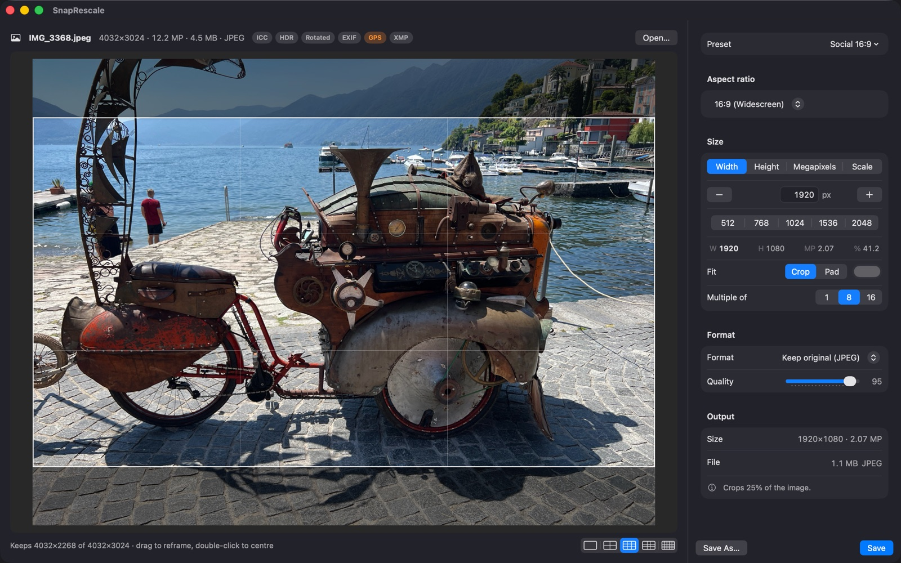

# SnapRescale

**Resize to any ratio, snapped to multiples of 8 and 16.**

SnapRescale is a free, native macOS utility for resizing one image to the
dimensions your workflow needs. Choose an aspect ratio and set width, height,
megapixels or scale. Snap dimensions to multiples of 8 or 16 for AI image
workflows, or use ordinary pixel dimensions.

Preview the crop before saving, drag to adjust the framing, or pad with a
chosen colour. Save useful settings as presets. Images are processed locally,
without accounts or uploads.



## Requirements and installation

- macOS 26 or later, Apple Silicon (that is what has been built and tested).
- **Mac App Store:** release pending review. The link will appear here.
- **Direct download:** a notarised DMG will be attached to the GitHub releases
  page once the Developer ID certificate is in place.
- **Build it yourself:** see [Building](#building) below.

## Using it

1. **Open an image.** Right-click it in Finder → *Open With → SnapRescale* (or
   *Services → Resize with SnapRescale*). Opened that way, the app quits after
   saving. Or open SnapRescale from Applications, then drop an image on the
   window or press ⌘O; it then stays open.
2. **Choose the size.** Pick an aspect ratio — *Original* keeps the image's own
   ratio; the picker also offers 1:1, 2:3, 3:2, 3:4, 4:3, 9:16, 16:9 and 21:9 —
   and one number: width, height, megapixels or scale. The other three follow.
   *Multiple of 8/16* rounds onto that lattice and says what it changed;
   *Multiple of 1* means no snapping. The preview shows the crop; drag the frame
   to reframe, or switch to *Pad*.
3. **Save.** ⌘S opens the save panel, pre-filled with `name_WxH`. Settings can
   make ⌘S save beside the original without asking (it asks for each folder
   once). The file size shown before saving is a real encode.

Brief in-app help is on ⌘?; the same text is in [docs/HELP.md](docs/HELP.md).

## What it does and doesn't do (1.0)

- One image at a time. Output formats: JPEG, PNG, HEIC, TIFF, or the source's
  own format when it is one of those.
- **Output is 8-bit sRGB with metadata stripped.** EXIF, GPS, XMP and AI
  workflow data are not carried over — a resized ComfyUI PNG no longer reopens
  its generation graph. Orientation is baked in. The badges next to the file
  name show what was *detected* in the source, not what will be preserved.
- Animated images use their first frame.
- Presets store size and export settings as plain JSON you can edit and share.
- Planned next, in order: metadata keep/strip controls and workflow
  carry-over, multiple windows, WebP and encoder options. See
  [docs/ROADMAP.md](docs/ROADMAP.md).

## Building

Prerequisites: Xcode 26 (Swift 6.2), [xcodegen](https://github.com/yonaskolb/XcodeGen)
and librsvg for the icon (`brew install xcodegen librsvg`), Python 3 (ships
with Xcode's command line tools).

```sh
./Scripts/build-app.sh                        # fast dev build, unsandboxed → build/SnapRescale.app
open -a build/SnapRescale.app photo.heic      # or launch it and drop an image on the window
./Scripts/build-xcode.sh Release              # store-style build: sandboxed, hardened → build/xcode/SnapRescale.app
cd RescaleKit && swift test                   # the engine's tests
```

The Xcode project is generated from `project.yml`; the `.xcodeproj` is not
committed. Under the sandbox, files must arrive by Open With, drop, ⌘O or
Services — a path in `--args` is not readable there, which is why the dev
build exists. The app icon is a macOS 26 Liquid Glass package,
`SnapRescale/AppIcon.icon`; `Scripts/make-icns.sh` rasterises the flat
fallback. Release and App Store steps are in [docs/RELEASING.md](docs/RELEASING.md).

### Layout

- `RescaleKit/` — the engine: solver, image pipeline, metadata detection,
  presets. No UI. A throwaway `rescale` CLI exercises it (`--write` writes a
  file; without it, it only prints the solve).
- `SnapRescale/` — the SwiftUI app.
- `prototype/` — the Python model of the solver the Swift port is checked
  against (5,940-case parity fixture).
- `docs/` — [PRD](docs/PRD.md), [roadmap](docs/ROADMAP.md), [help](docs/HELP.md),
  [what the badges detect](docs/reference/image-metadata.md), reviews.

## Licence

MIT — see [LICENSE](LICENSE). The same text ships inside the app bundle.

## Acknowledgements

Inspired by the *Resize Image/Mask* and *Resolution Selector* nodes in
[ComfyUI](https://github.com/comfyanonymous/ComfyUI), whose way of thinking
about resizing — aspect ratio plus one number, snapping to a multiple — is the
starting point. SnapRescale implements its own resizing solver and macOS image
pipeline; the aspect-ratio names in the picker are theirs. ComfyUI is GPL-3.0
and none of its code is used. Provenance notes: [docs/reference/comfyui-node-review.md](docs/reference/comfyui-node-review.md).

I thank the ComfyUI team and contributors for the excellent work.

Support and bug reports: [issues](https://github.com/phierru/SnapRescale/issues).
Privacy: [docs/PRIVACY.md](docs/PRIVACY.md) — nothing leaves your Mac.
