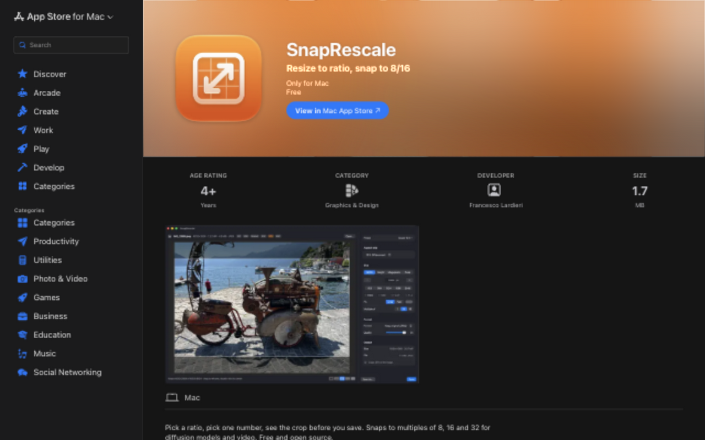
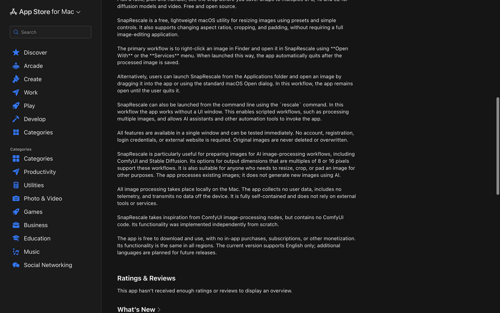
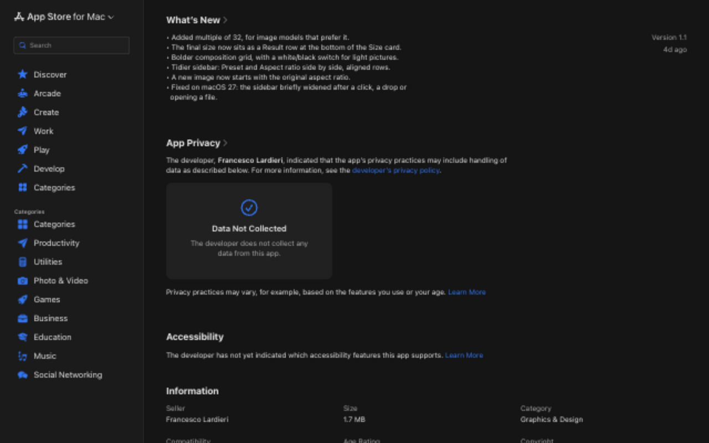

# SnapRescale storefront review — 2026-10-03

**Recommendation:** keep resizing as the main promise, and make metadata control the reason to update. The current page establishes a small, local Mac utility, but its single screenshot undersells the product and its description includes claims that should not carry into the next release.

Recommended subtitle: **Resize, crop & keep metadata** (28 characters).

The companion [release-copy proposal](app-store-release-copy-2026-10-03.md) contains ready-to-paste name, subtitle, promotional text, description, What's New and keywords, with checked field lengths. This report supplies the reasoning and a five-image screenshot brief. Nothing was submitted to Apple, and the existing APP-STORE.md draft and application source were left unchanged.

**Owner comment:** Subtitle **Resize, crop & choose metadata** (30 characters): the default strips camera details, GPS, IPTC and XMP, so "keep metadata" would promise what a first save does not do. The next release is 1.2 (decided 2026-10-04). The copy proposal, corrected, becomes the draft of record in APP-STORE.md (#63); the README and the store description are updated at upload (#64).

## Scope and evidence

Reviewed the [US storefront](https://apps.apple.com/us/app/snaprescale/id6809174592?mt=12) in the collaborative browser on 2026-10-03, at a 1280×800 viewport. It displayed version 1.1, one app screenshot, Graphics & Design, a free download, and a macOS 26.0 minimum. Description and release notes were expanded. The captures below were saved and inspected, then copied unchanged into this report's asset directory.

Compared public claims and the local listing draft with current source at `fa50d19593e2574692aa1aef7e617d3ccd5e3b47`. The codebase graph was refreshed in full before this review. Discovery used graph tools and source verification; stale worktree symbols were excluded. Parallel reviews checked feature claims, Apple requirements and the proposed wording.

This is an audit of the web storefront and proposed release messaging, not a test of the downloaded 1.1 binary or the future submitted archive. No App Store Connect account, private keyword field, analytics, native App Store layout, or assistive-technology behavior was inspected. Conversion and search-ranking effects are hypotheses, not measured outcomes.

## 1. First impression and screenshot shelf — needs improvement

**Keep:** the distinctive orange icon, recognizable app name, straightforward Mac positioning and real app-in-use screenshot. The existing promotional opening describes the ratio/size/preview workflow well.

**Improve:** the subtitle leads with ratio and 8/16 terminology. It omits the already-shipped 32 option and gives a newcomer little reason to choose the app. The sole full-window screenshot shows cropping, but its small controls are difficult to read at shelf size and it has no explanatory headline. New metadata features need new screenshots when their release ships.

Use the proposed subtitle and the five-screen sequence below. Make the first image communicate the resizing result at a glance; follow with metadata choices and embedded PNG workflows. Keep technical multiples in the description and sizing screenshot. If technical image-workflow users are the deliberate primary audience, the alternative subtitle in the copy proposal includes 8/16/32 and fits the limit.

**Visible accessibility concern:** screenshot text needs to remain readable when reduced to a thumbnail. Use short, high-contrast captions and explain the same benefits in the plain-text description. This observation does not establish the app's contrast or VoiceOver support. Apple's surrounding page layout and rendering are outside the developer's control.

**Owner comment:** Agreed that the shelf needs new screenshots. Whether they carry captions is decided at release (#64); the photos are chosen (2026-10-04).

## 2. Expanded description — correct claims before release

The description explains local processing and the lack of accounts clearly. However, much of it reads as instructions for App Review: launch modes, automatic quitting, immediate testability, implementation provenance and regional availability precede the strongest product benefits. Markdown emphasis and backticks appear literally in the public description.

| Priority | Observed issue | Recommended change |
|---|---|---|
| High | The live description advertises a headless `rescale` command and scripted processing of multiple images. | Remove this from the Mac App Store description. The current archive configuration includes the app and RescaleKit library; the separate developer CLI is not a bundled command-line feature. See [project.yml](../project.yml#L32), [CLI target](../RescaleKit/Package.swift#L17), and [main app scene](../SnapRescale/Sources/SnapRescale/SnapRescaleApp.swift#L9). |
| High | The live description gives an unconditional guarantee against overwriting originals. | Remove the absolute guarantee. [saveAs](../SnapRescale/Sources/SnapRescale/Session.swift#L473) accepts a user-chosen destination, and [write](../SnapRescale/Sources/SnapRescale/Session.swift#L520) can replace that file after save-panel confirmation. The listing can simply describe saving the result. |
| Medium | Launch/quit behavior is described as universal for Finder opening. | Say that images can be opened directly from Finder. Put context-dependent auto-quit details in Help/App Review Notes. |
| Medium | Dense operational prose and literal formatting obscure the value. | Use a short benefit-led opening followed by concrete capabilities in plain text. Move testing and implementation-history material out of consumer copy. Apple's description field is plain text; see [platform metadata](https://developer.apple.com/help/app-store-connect/reference/app-information/platform-version-information). |
| Medium | The local next-release draft makes stronger claims than the implementation about preserving the typed number, inspecting provenance and exporting all metadata. | Describe visible final dimensions and snapping adjustments; say embedded AI generation data, not verified provenance; say metadata details or supported metadata, not a complete archive. |

The first two recommendations are based on the current release implementation. This review did not inspect the old downloaded binary to establish every behavior of version 1.1.

**Accessibility boundary:** simplifying the public description improves scanning, but screenshots and source inspection cannot establish keyboard navigation or screen-reader usability inside the app.

**Owner comment:** Agreed. The live `rescale` command, automation and AI-assistant, and "never overwritten" claims are in no repo draft, and the next submission replaces them (#63). One correction: the app does take launch arguments, `--save` among them, so a single image can be saved from a script; that is still not a headless command, and the copy does not advertise it.

## 3. Release notes, privacy and accessibility — good foundation, incomplete details

The current 1.1 notes are specific and readable. For the next release, lead with inspecting metadata, choosing what survives a save, and retaining embedded ComfyUI workflows in PNG-to-PNG output. Include colour-profile and higher-bit-depth support as supporting improvements. Do not recycle the previous layout fixes as the headline.

The public Data Not Collected declaration is consistent with the inspected local-processing design. Keep privacy messaging prominent, but distinguish **data collection by the app** from **metadata retained in the saved image**. The default intentionally keeps supported AI workflow data; that can contain prompts or other details. Avoid promises of complete anonymization or removal of every EXIF/XMP field.

The page currently has no declared accessibility features. Evaluate the release's common tasks—open, size, reframe, inspect metadata, change retention, save and settings—before declaring support. An empty declaration does not prove the app lacks accessibility. Apple requires the app's common tasks to work with a feature before claiming it in [Accessibility Nutrition Labels](https://developer.apple.com/help/app-store-connect/manage-app-accessibility/overview-of-accessibility-nutrition-labels). This review did not perform that evaluation.

**Category discrepancy:** the public page says Graphics & Design, the local [listing draft](APP-STORE.md#L10) proposes Photo & Video, and [Info.plist](../SnapRescale/Info.plist#L15) declares `public.app-category.photography`. Resolve this in the release metadata. My preference is to keep the existing Graphics & Design positioning for an image-preparation utility and align the next build and draft with it; Photo & Video is also defensible if photographers are the intended primary audience. This is a positioning choice, not an established ranking advantage. Apple says the macOS category in the build should match the App Store Connect primary category. [App information](https://developer.apple.com/help/app-store-connect/reference/app-information/app-information/), [category guidance](https://developer.apple.com/app-store/categories/).

The Developer Website currently points to the GitHub repository. That is useful for source access. A small consumer landing/help page could later make the resize workflow and metadata policy easier to understand; it is lower priority than accurate copy and screenshots. The linked website itself was not audited here.

**Owner comment:** Category: Graphics & Design primary, Photo & Video secondary, in the build's Info.plist and in the draft (#62). What's New says the default changed: 1.1 removed all metadata, and the new default keeps AI workflow data, prompts included (#63). Accessibility is evaluated before any label is declared (#64). The landing page is not scheduled.

## Proposed screenshot sequence

Create five consistent **2880×1800** opaque images from the actual release build. These are production briefs, not newly generated screenshots. The report images above capture the old storefront only.

| Order | Caption | What the real app should show | Purpose and guardrail |
|---|---|---|---|
| 1 | **Get the size right. See the crop.** | Attractive owned/licensed photo; obvious 16:9 crop; size/result controls and grid readable. | Explain the primary job immediately. Give the UI most of the canvas; show accurate final dimensions. |
| 2 | **Choose what stays with your image.** | Metadata inspector for a sample photo; camera/GPS information and the Default policy visible. | Show the new control. Use deliberately fictional sample metadata; label Strip/Keep in words rather than relying on colours. |
| 3 | **Keep the workflow inside your PNG.** | A PNG containing an embedded ComfyUI workflow; AI workflow Keep and PNG output visible. | Show the specialized benefit. Add a short PNG-to-PNG qualifier; use benign sample prompts and a workflow that fits read limits. |
| 4 | **Add space around the picture.** | Pad mode with a clear, attractive canvas colour or transparency preview; original image comfortably inside the new aspect ratio. | Make padding visibly different from cropping. If showing transparency, select a supporting output format. |
| 5 | **Pick a format. Check the file size.** | Format, quality and calculated output-byte controls with the image still visible. | Explain export decisions. A saved preset can appear as supporting detail; do not imply a target-byte auto-compression feature. |

Use the orange brand colour sparingly for captions or a background accent, consistent typography, and one benefit per image. Avoid turning the sequence into a tour of dropdown menus or a Settings window. Inspect the finished images both at full size and at a narrow shelf width; the caption must carry the idea without requiring the viewer to read every control. Preserve truthful UI proportions and contents.

**Owner comment:** The sequence is decided at release (#64). Corrections to the brief: in shot 5 the file size is a readout, not a control, and Quality shows only for JPEG and HEIC; in shot 4 transparency needs PNG, HEIC or TIFF; in shot 2 Keep and Strip are already labelled in words; screenshots made with `--window 1440x900` fill the 2880×1800 frame, so a caption needs a smaller window or a framed composition. Photos (2026-10-04): `IMG_2946.jpeg` for EXIF, GPS and colour profile (its real location becomes public), a Replicate PNG for IPTC and XMP, a ComfyUI PNG for the workflow.

Apple accepts 1–10 screenshots. Mac sizes are 1280×800, 1440×900, 2560×1600 or 2880×1800; JPG/JPEG/PNG must have no alpha channel. [Screenshot specifications](https://developer.apple.com/help/app-store-connect/reference/app-information/screenshot-specifications). Screenshots should show actual app use; explanatory overlays are allowed, and imagery must be appropriately licensed. [App Review Guidelines 2.3.3 and 2.3.9](https://developer.apple.com/app-store/review/guidelines/#accurate-metadata).

## Claim boundaries for this release

| Capability | Supported wording | Boundary verified in source |
|---|---|---|
| Resizing | Aspect ratio plus width, height, megapixels or scale; multiples of 8/16/32 | The typed axis can be snapped too. Avoid promising unchanged input. [Solver](../RescaleKit/Sources/RescaleKit/Solver.swift#L106). |
| Presets | Reusable size and export settings | Presets do not capture every app preference or crop framing. [Preset schema](../RescaleKit/Sources/RescaleKit/Preset.swift#L34). |
| Metadata choices | Inspect supported metadata and choose what to keep or remove | Default sets EXIF/GPS/IPTC/XMP policies to Strip and ICC/AI to Keep. AI retention can intentionally populate EXIF UserComment or XMP fields; structural tags can also remain. These switches do not guarantee empty metadata containers. [Policy](../RescaleKit/Sources/RescaleKit/MetadataPolicy.swift#L80), [writer](../RescaleKit/Sources/RescaleKit/MetadataWriter.swift#L75). |
| Embedded workflows | Keep embedded ComfyUI workflows when resizing PNGs and saving as PNG | Existing payloads, supported PNG route, AI Keep and successful capture within read limits are required. This is not a workflow editor or provenance certification. [PNG splicing](../RescaleKit/Sources/RescaleKit/PNGSplicer.swift#L37). |
| Metadata exports | Export workflows and captured metadata details | Not a lossless backup of every original block. Oversized/skipped data cannot be exported or preserved. [Export](../RescaleKit/Sources/RescaleKit/MetadataExport.swift#L41), [budgets](../RescaleKit/Sources/RescaleKit/PNGScanner.swift#L43). |
| Colour and depth | Preserve supported profiles or convert to sRGB; 16-bit PNG/TIFF from compatible sources | Some colour models fall back to sRGB; JPEG is 8-bit, HEIC uses a separate 10-bit path for deep sources. Do not promise HDR gain-map preservation or lossless resizing. [ColorPlan](../RescaleKit/Sources/RescaleKit/ColorPlan.swift#L13). |
| Scope and formats | One image at a time; JPEG, PNG, HEIC and TIFF output | No shipped batch UI/CLI. Animated inputs use frame 0. Transparency requires a compatible output. [Session](../SnapRescale/Sources/SnapRescale/Session.swift#L251), [SourceImage](../RescaleKit/Sources/RescaleKit/SourceImage.swift#L85), [OutputFormat](../RescaleKit/Sources/RescaleKit/OutputFormat.swift#L5). |

**Owner comment:** Agreed, with one correction: HEIC shares the 16-bit render path and is encoded at 10 bits; there is no separate HEIC path. Four links point a few lines off at `fa50d19`: `Session.swift#L520` (`write` is at L510), `PNGSplicer.swift#L37` (`keepingAIWorkflow` is at L46), `SourceImage.swift#L85` (the frame-0 decode is at L99) and `PNGScanner.swift#L43` (the budget is at L46). They are left as written.

## Release priorities and validation

1. Use the corrected [copy proposal](app-store-release-copy-2026-10-03.md) with the new metadata build. Keep upcoming-feature claims out of the live 1.1 promotion until they are available.
2. Produce the five real screenshots, prioritizing the first three if time is limited. Verify the depicted metadata and saved PNG workflow using the final archive and a real downstream consumer.
3. Choose the next version/build number and align category metadata. Confirm the final archive's compatibility and feature set; this review does not certify an uploaded build.
4. Evaluate accessibility before adding its declarations. After release, confirm the public US page has the intended copy/images; assess observed product-page/download results only when sufficient data exists.

Field limits and keyword rules were checked against current Apple references. The copy uses 95 ASCII bytes of generic keywords; it excludes other app/company names and two-character terms. Live keywords and search demand remain unknown. No claim is made that these terms will improve ranking.

Validation performed: live storefront inspection and saved captures; graph refresh and current-source claim checks; official Apple requirement checks; proposed field-length checks and local artifact/link checks. No application tests were rerun for this documentation-only task. Existing source, the prior documentation review, and the App Store draft were not edited.

## Resolution log (coding assistant, 2026-10-04)

On `review/docs-storefront-2026-10-03` (tracking #65), with the [copy proposal](app-store-release-copy-2026-10-03.md). What belongs to the upload is in #64.

| Finding | Status | Commit · issue |
|---|---|---|
| Subtitle and copy proposal | **Adopted, corrected.** Subtitle "Resize, crop & choose metadata"; the corrected proposal is the 1.2 draft of record in APP-STORE.md, lengths counted again (subtitle 30, promotional text 153, description 1,895, What's New 1,082, keywords 93 bytes), next to a transcript of the live 1.1 listing | `e0a262e` · #63 |
| §1 screenshot shelf | **At upload.** Photos chosen (2026-10-04); sequence, captions and per-shot commands are decided then | #64 |
| §2 description claims | **Fixed in the draft.** No `rescale` command, automation, AI-assistant or "never overwritten" claims | `e0a262e` · #63 |
| §3 category | **Fixed.** Graphics & Design in the build's Info.plist and in the draft; Photo & Video as secondary is set in App Store Connect | `c3924df` · #62, #64 |
| §3 What's New | **Fixed.** It says the default changed: 1.1 removed all metadata, 1.2 keeps supported colour profiles and AI workflow data, prompts included | `e0a262e` · #63 |
| §3 accessibility | **At upload.** Evaluated before any label is declared | #64 |
| §3 landing page | **Not scheduled** | #65 |
| Screenshot sequence | **Corrected** in the Owner comment; used at upload | #64 |
| Release priority 3 | **Decided.** Version 1.2; the version and build number are bumped at upload | #64 |

**Verified:** the field lengths, and the draft's claims against the code and the CHANGELOG's Unreleased section, by an independent check of the whole branch.

**Not verified:** nothing was entered in App Store Connect. Screenshots, the public page and accessibility wait for the upload (#64).
